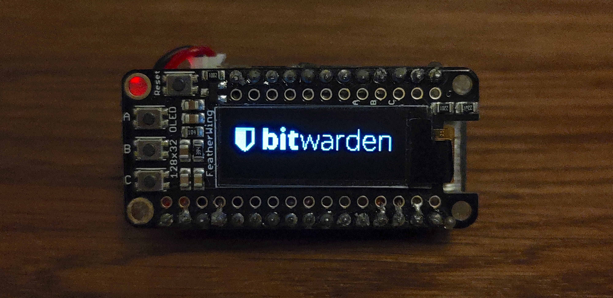

# POC: Bitwarden Hardware Key

Playground for experimenting with a Bitwarden Hardware Key.



## Platform

This project is built on the popular ESP32 platform. The ESP32 is a low-cost, low-power microcontroller with integrated Wi-Fi and Bluetooth capabilities. It is a popular choice for IoT projects and is well supported by multiple frameworks. We are using `esp-rs` which based on ESP-IDF, the official development framework for the ESP32. EPS-IDF is written in C, but `esp-rs` provides a Rust wrapper around it. ESP-IDF is in turn based on FreeRTOS, a popular real-time operating system.

## Hardware requirements

This project is currently being developed on an Adafruit HUZZAH32 – ESP32 Feather Board connected to a 128x32 SSD1306 OLED Feather Wing. The HUZZAH32 board is a development board for the ESP32 microcontroller. It has a built-in USB-to-Serial converter, making it easy to program and debug. It also has a built-in LiPo battery charger, making it easy to power the board with a rechargeable battery.

### Simulation

This project does not currently support simulation/emulation.

## Getting started

The following steps are based on https://github.com/esp-rs/esp-idf-template#prerequisites. Please refer to that document in case this one is outdated.

  1. `brew install cmake ninja dfu-util libuv`
  2. Optional: `brew install ccache`
  3. `xcode-select --install`
  4. `/usr/sbin/softwareupdate --install-rosetta --agree-to-license` 
     If you get an error similar to the following:
     ```
     WARNING: directory for tool xtensa-esp32-elf version esp-2021r2-patch3-8.4.0 is present, but tool was not found
     ERROR: tool xtensa-esp32-elf has no installed versions. Please run 'install.sh' to install it.
     ```

     or:

     ```
     zsh: bad CPU type in executable: ~/.espressif/tools/xtensa-esp32-elf/esp-2021r2-patch3-8.4.0/xtensa-esp32-elf/bin/xtensa-esp32-elf-gcc
     ```
  5. Make sure rustup is installed: https://rustup.rs/ (ideally this is how you've installed rust on your system)
  6. `cargo install espup espflash cargo-espflash`
     - If you have issues with OpenSSL you can try an alternative binary install:
       - `cargo install binstall`
       - `cargo binstall espup espflash cargo-espflash`
  6. `cargo install cargo-generate ldproxy cargo-espflash`
  7. `espup install`
  8. `. $HOME/export-esp.sh`
    This step must be done every time you open a new terminal.
        See other methods for setting the environment in https://esp-rs.github.io/book/installation/riscv-and-xtensa.html#3-set-up-the-environment-variables
  9. Clone repository

## Building and flashing

### Running on ESP32

In theory `cargo run` should be enough.

### Desktop emulator

`cargo run --bin desktop --target x86_64-apple-darwin`. You might need to tweak your target depending on your OS.

### Troubleshooting

#### C-compilation error
Issue: https://github.com/esp-rs/esp-idf-template/issues/174

If you get an error similar to the following:
```
The C compiler

      "/Users/andreas/code/playground/esp32-playground-win/.embuild/espressif/tools/xtensa-esp32-elf/esp-12.2.0_20230208/xtensa-esp32-elf/bin/xtensa-esp32-elf-gcc"

    is not able to compile a simple test program.

    It fails with the following output:

      Change Dir: /Users/andreas/code/playground/esp32-playground-win/target/xtensa-esp32-espidf/debug/build/esp-idf-sys-9cd14215ea73b32d/out/build/CMakeFiles/CMakeTmp
```

Workaround: `CRATE_CC_NO_DEFAULTS=1 cargo run`

**NOTE:** This will likely also cause issues with the `rust-anaylzer` VS Code extension. You can use the same workaround by editing your VS Code `settings.json` (open the file by searching for `Preferences: Open User Settings (JSON)`) and adding the following:

```json
"rust-analyzer.cargo.extraEnv": {
  "CRATE_CC_NO_DEFAULTS": "1"
}
```

#### Rust compiler crash (SIGSEGV)

If you get a Rust compiler crash with error:
```
error: rustc interrupted by SIGSEGV, printing backtrace
...
note: we would appreciate a report at https://github.com/rust-lang/rust
help: you can increase rustc's stack size by setting RUST_MIN_STACK=16777216
```

This is caused by the Xtensa LLVM backend requiring more stack space during compilation. The fix has already been added to the `export-esp.sh` file in this repository.

**Solution:** Make sure you're sourcing the `export-esp.sh` file:
```bash
. $HOME/export-esp.sh
```

If you're using a different ESP environment setup, you can manually set:
```bash
export RUST_MIN_STACK=16777216
```

Add this to your shell profile or ESP environment script to make it permanent.